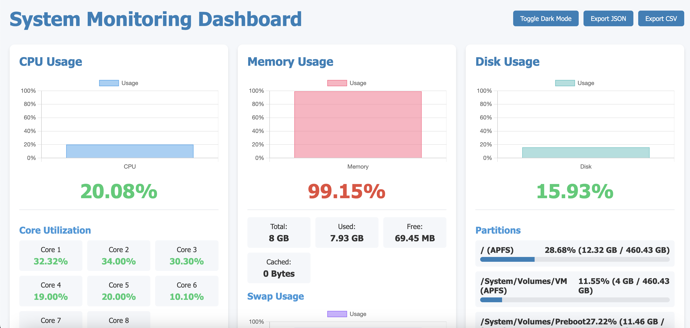

# System Monitoring Dashboard

A comprehensive real-time system monitoring dashboard that provides detailed insights into your system's performance metrics.



## Features

- **Real-time Monitoring**: Live updates of CPU, memory, disk, and network usage
- **Multi-core CPU Tracking**: Monitor individual CPU core performance
- **Memory & Swap Analysis**: Track RAM and swap usage with detailed metrics
- **Disk Monitoring**: View partition usage and I/O performance
- **Network Activity**: Monitor download/upload speeds and connection counts
- **Process Management**: View and terminate resource-intensive processes
- **Historical Data**: View performance trends over time (hour, day, week)
- **Dark/Light Theme**: Toggle between themes for comfortable viewing
- **Customizable Alerts**: Set thresholds for CPU, memory, and disk usage
- **Self-Healing**: Optional automatic actions when thresholds are exceeded
- **Data Export**: Export monitoring data in JSON or CSV formats

## Installation

```bash
# Clone the repository
git clone https://github.com/me-ruhin/system-monitoring-tools

# Navigate to the project directory
cd system-project

# Install dependencies
npm install

# Start the application
npm start